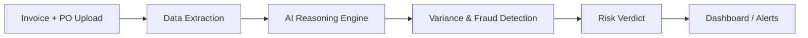

# 🛡️ SME Resilience Agent

### *AI-Powered Financial Integrity for Supply Chains*


**Google Solution Challenge 2026 | Team 405 Not Found**
<p align="center">
  
  
  
  
  
</p>

---

<p align="center">
  <b>Stop fraud before it stops the supply chain.</b><br/>
  Multimodal AI agent detecting invoice anomalies, spoofing, and financial risk in real time.
</p>

---

## 🚀 Why This Matters

Supply chains don’t fail only because of logistics — they fail because of **financial vulnerabilities**.

SMEs (90%+ of global businesses) are frequent targets of:

* 💸 Invoice manipulation
* 🎭 Vendor impersonation (BEC attacks)
* 🔁 Bank detail fraud

**Impact:**
A single fraudulent transaction can cascade into:

* Delayed shipments
* Cash flow disruption
* System-wide bottlenecks

👉 **We solve this at the source — financial verification.**

---

## 💡 What We Built

**SME Resilience Agent** is a **multimodal AI forensic auditor** that:

* Cross-checks **Invoices vs Purchase Orders**
* Detects **price anomalies, fraud signals, and inconsistencies**
* Generates **explainable risk verdicts** for decision-makers

Powered by **Gemini 1.5 Flash**, it combines:

* Document understanding
* Financial reasoning
* Explainable AI

---

## 🧠 Core Capabilities

### 🔍 Multimodal Intelligence

Processes:

* 📄 PDF Invoices
* 🧾 PO Documents (Images / Digital)

---

### ⚠️ Real-Time Risk Detection

* Flags **>3% price deviations**
* Detects **bank account mismatches**
* Identifies **vendor/domain spoofing**

---

### 🧾 Explainable AI (Not a Black Box)

Clear reasoning with traceable steps:

* Entity extraction
* Line-item comparison
* Variance calculation
* Risk classification

---

### 📊 Financial Proof Engine

[
\frac{|Invoice - PO|}{PO} > 3%
]

Visual + mathematical validation for **trust and auditability**

---

### 🔐 Resilience by Design

* **Demo Mode fallback** for unstable networks
* Built for **real-world constraints in SMEs**

---

## 🏗️ System Flow



---

## 🛠️ Tech Stack

| Layer           | Technology                          |
| --------------- | ----------------------------------- |
| 🧠 AI Engine    | Gemini 1.5 Flash (Google GenAI SDK) |
| 🖥️ Frontend    | Streamlit                           |
| ⚙️ Backend      | Python 3.10+                        |
| ☁️ Deployment     | Streamlit Community Cloud         |
| 🧩 Architecture | Serverless Microservices            |

---

## 📂 Project Structure

```
├── app.py              # Streamlit UI
├── engine.py           # AI reasoning logic
├── data/               # Sample test documents
├── requirements.txt    # Dependencies
└── README.md           # You're here
```

---

## 🎯 SDG Alignment

* **Goal 9.3** → Empower SMEs in global supply chains
* **Goal 12.2** → Efficient financial resource management

---

## ⚡ What Makes This Stand Out

This is **not just another AI project**:

| Typical Projects     | This Project                 |
| -------------------- | ---------------------------- |
| Basic classification | Financial forensic reasoning |
| Black-box outputs    | Explainable AI decisions     |
| Toy datasets         | Real-world document flows    |
| Static models        | Adaptive + resilient system  |

---

## 🌐 Architecture Highlights

* ⚡ Serverless → Scalable, cost-efficient
* 🧠 AI-first → Decision engine, not just automation
* 🔄 Feedback-ready → Extensible for continuous learning
* 🔐 Secure → Designed for financial data sensitivity

---

## 👥 Team

**405 Not Found**

**Gautam N Chipkar (Team Lead)**
🔗 GitHub: [https://github.com/gee-46](https://github.com/gee-46)

🏫 SG Balekundri Institute of Technology (SGBIT)

---

## 🚀 Future Roadmap

* 🔗 ERP Integrations (SAP, Oracle)
* 📡 Real-time anomaly alerts
* 🧮 Vendor risk scoring system
* ⛓️ Blockchain-backed audit trails
* 🤖 Autonomous procurement validation

---

## 📸 Demo (Add Later)

* UI Screenshot
* Sample Invoice vs PO Analysis
* Risk Verdict Output

---

## 🏁 Final Note

> Supply chains don’t just need speed — they need **trust**.
> We’re building the layer that ensures both.

---
